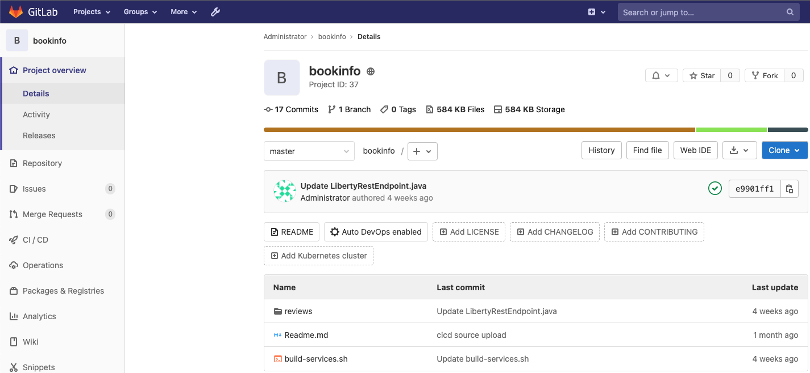
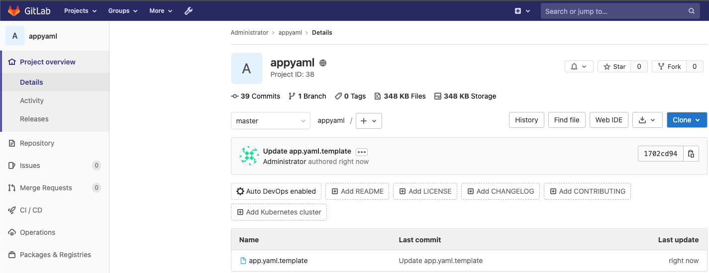
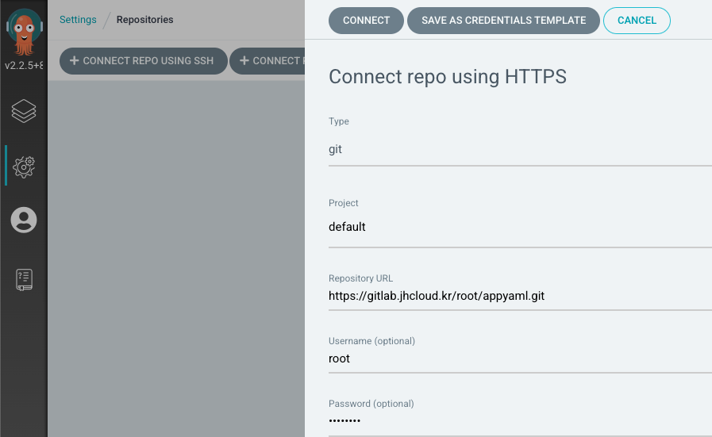
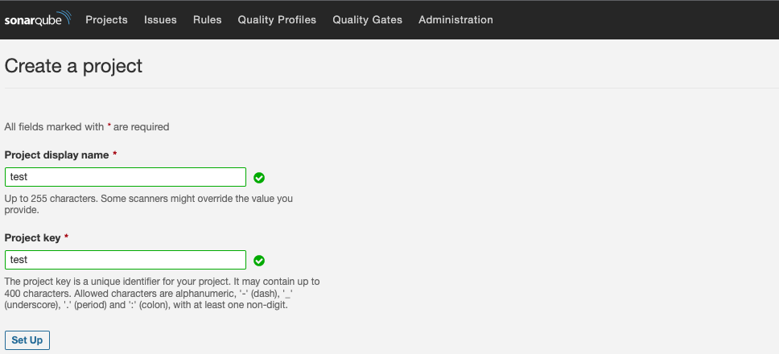
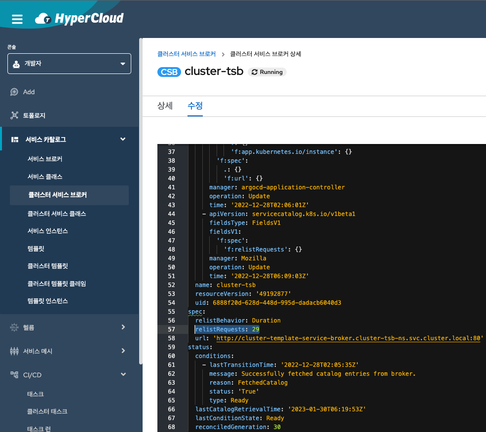
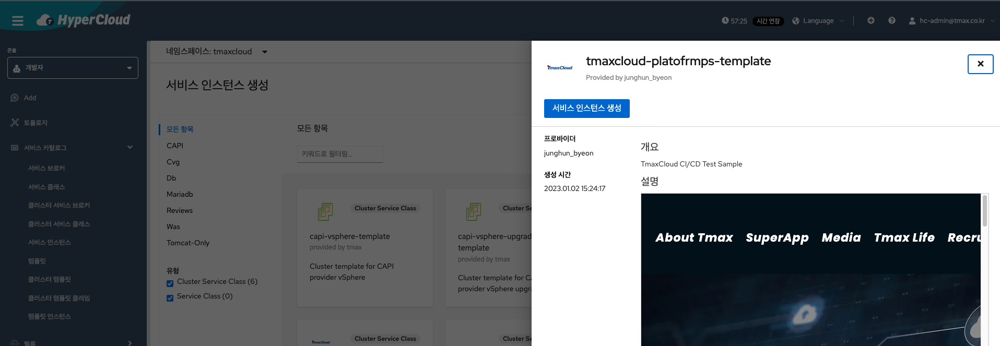
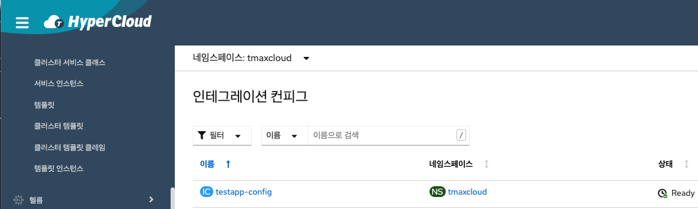
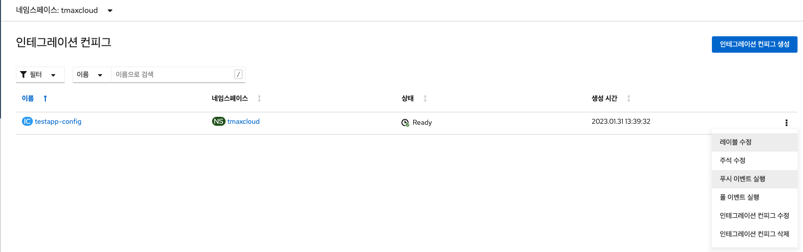

# bookinfo CI/CD with cicd-operator
해당 문서는 HyperCloud의 cicd-operator 및 IntegrationConfig를 활용한 CI/CD 문서입니다.<br>
모든 Task와 작업은 외부와 통신이 가능한 환경 기준으로 작성이 되어 있습니다.<br>
폐쇄망 기준으로 작업을 진행할 경우 각 Task를 알맞게 수정을 하여야 합니다. (ex. image의 주소 등)
> 각 Task 별 상세 설명은 작성중

## 준비물
- HyperCloud (cicd-operator)
- Gitlab
- ArgoCD
- Argo Rollout (Optional)
- Sonarqube (Optional)
- [<span style='color:yellow'>bookinfo source</span>](https://git.jhcloud.kr/junghun_byeon/bookinfo.git)
- [<span style='color:yellow'>ClusterTask</span>](https://git.jhcloud.kr/junghun_byeon/bookinfo-cicd-tmaxcloud/src/branch/main/clustertask)
- [<span style='color:yellow'>Template</span>](https://git.jhcloud.kr/junghun_byeon/bookinfo-cicd-tmaxcloud/src/branch/main/template)

## Gitlab Porject 생성

- [<span style='color:yellow'>bookinfo source</span>](https://git.jhcloud.kr/junghun_byeon/bookinfo.git) 프로젝트의 소스를 수행하는 환경의 Gitlab에 추가.


- [<span style='color:yellow'>Template</span>](https://git.jhcloud.kr/junghun_byeon/bookinfo-cicd-tmaxcloud/src/branch/main/template) 프로젝트에서 [<span style='color:yellow'>"app.yaml.template"</span>](https://git.jhcloud.kr/junghun_byeon/bookinfo-cicd-tmaxcloud/src/branch/main/template/app.yaml.template)을 받아 수행하는 환경의 Gitlab에 추가.
- <span style='color:yellow'>프로젝트 명, 파일 명, 파일 경로 모두 동일하게 생성</span> (수정을 원하는 경우 template.yaml 에서 수정 필요)

## ArgoCD Application 등록

- ArgoCD에 접속 및 로그인
- Settings > Repositories > Connect repo using HTTPS 메뉴에서 생성한 <span style='color:yellow'>appyaml</span> 프로젝트 등록


- Successful 상태 확인
    - 상태가 <span style='color:red'>Failed</span>인 경우
        - 등록한 Repository URL 확인
        - 사설 인증서를 사용하는 Gitlab 환경이면 Repository 추가시 Skip server verification 체크

## Sonarqube 프로젝트 추가 (Optional)

- Projects > Create Project > manual 선택
- Project display name 입력 (Project key 자동 입력) > Set Up 클릭 > 생성 확인


## ClusterTask 추가
- [<span style='color:yellow'>clustertask</span>](https://git.jhcloud.kr/junghun_byeon/bookinfo-cicd-tmaxcloud/src/branch/main/clustertask)에서 모든 yaml을 받아 수행하는 환경에 apply
- HyperCloud Console을 통해서 추가하여도 무방
- sendmail task를 사용할 경우 mailsecret.yaml 수정 필요
```
kind: Secret
apiVersion: v1
metadata:
  name: server-secret
stringData:
  url: "mail.tmax.co.kr"
  port: "25"
  user: "이메일"
  password: "패스워드"
  tls: "False"
```

## Template 추가
- [<span style='color:yellow'>template</span>](https://git.jhcloud.kr/junghun_byeon/bookinfo-cicd-tmaxcloud/src/branch/main/template)에서 template.yaml을 받아 수행하는 환경에 apply
- HyperCloud Console을 통해서 추가하여도 무방

## 서비스 브로커 갱신

- 개발자 콘솔 > 서비스 카탈로그 > 클러스터 서비스 브로커 > cluster-tsb 수정
- relistRequests 값을 +1 하고 저장

## 서비스 인스턴스 생성

- 개발자 콘솔 > 서비스 카탈로그 > 서비스 인스턴스 > 서비스 인스턴스 생성 > tmaxcloud-platofrmps-template 선택
- 각 피라미터 값을 수행하는 환경에 맞게 수정
```
이름 : 서비스 인스턴스의 이름
APP_NAME : 생성 될 앱의 이름
APP_REPOSITORY : appyaml 프로젝트의 경로 (ex. root/appyaml)
ARGOCD_URL : 수행하는 환경의 ArgoCD 주소 (https:// 제외)
ARGOPASS : 수행하는 환경의 ArgoCD의 패스워드 (base64 형태로 입력)
ARGOUSER : 수행하는 환경의 ArgoCD의 아이디 (base64 형태로 입력)
GITID : 수행하는 환경의 Gitlab 아이디
GITPWD : 수행하는 환경의 Gitlab 패스워드
GIT_API_URL : 수행하는 환경의 Gitlab 주소 (https:// 제외)
GIT_BRANCH : bookinfo source가 있는 branch
GIT_REPOSITORY : bookinfo source가 있는 프로젝트 주소 (ex. root/bookinfo)
GIT_TOKEN_SECRET : gitlab token을 저장한 secret의 이름 (사실상 불필요하나 없을 경우 cicd-operator 설정상 에러 발생)
IMAGE_NAME : 빌드 된 이미지가 저장될 harbor 프로젝트 (ex. reviews/reviews)
IMAGE_URL : 빌드 된 이미지가 저장될 harbor의 주소 (https:// 제외)
PROJECTKEY : 소스 코드를 분석할 sonaqube 프로젝트의 이름
PROJECTVERSION : 소스 코드 스캔을 수행할 Project의 Version, 임의 값 입력 (ex. 1.0)
REVIEWS_PORT : reviews pod가 사용할 Port (기본값 9080 변경 X)
SONARURL : Sonarqube의 주소 (http:// 포함)
SOURCEDIR : 스캔을 할 소스 파일의 경로 (기본값 ./reviews/reviews-application/src/main/java/application/rest/ 변경 X)
STORAGE_CLASS : Storage Class 선택
```

## 인테그레이션 컨피그 생성 확인

- 정상적으로 생성이 되었는지 확인 (상태 Ready 확인)
    - 상태 Ready가 아닌 경우
        - 수정 > YAML View을 통해서 원인 파악
        

- Ready인 것을 확인 할 경우 푸시 이벤트 발생